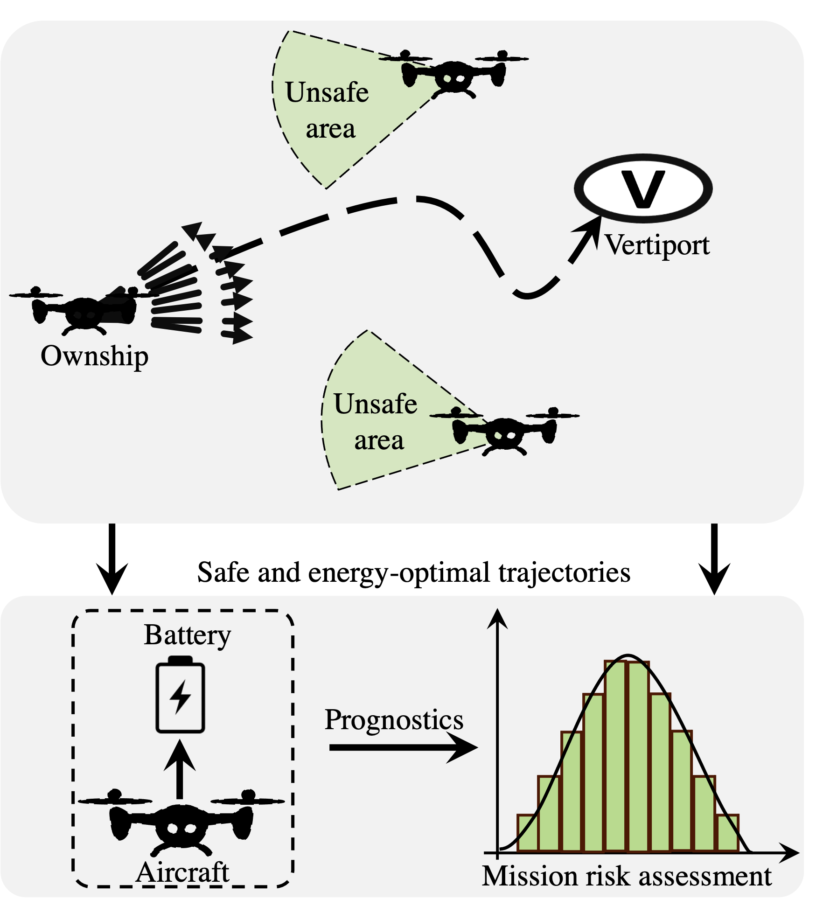
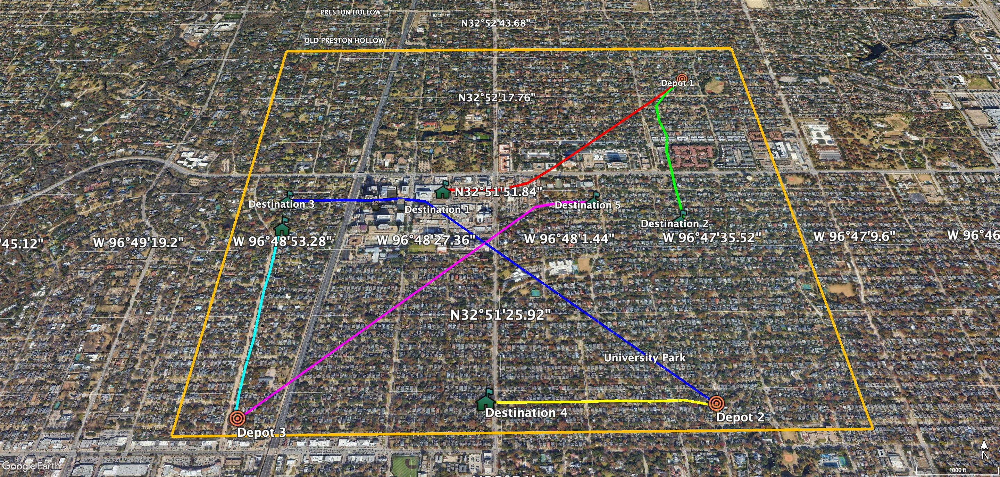

# Pre‑departure Flight Planning and Risk Assessment for UAM/UAS Operations under Battery Constraint

    

## Overview

This repository contains the implementation of a decision-making framework for Urban Air Mobility (UAM) and Unmanned Aerial Systems (UAS) operations, focusing on enhancing collision safety and battery energy use. The framework features a novel two-layer algorithm: the upper layer performs strategic de-confliction, and the lower layer handles prognostics and decision-making for mission execution.

## Package Delivery Scenario
The scenario we used to implement the framework and test its performance is designed for a package delivery application and is implemented for the University Park area of the Dallas-Fort Worth metropolitan region. It includes three depots from which aircraft are expected to take off, and random destination places can be assigned within the $7 km^2$ rectangular area.

    

## Project Structure

The project is organized into several key components:

### Trajectory Planner

- **Ownship.m**: A MATLAB class responsible for guidance modeling.
- **Planner.m**: A MATLAB class handling trajectory planning algorithms.
- **Trajectory Planning Results**: Contains saved data and figures.
- **planTrajectories.m**: MATLAB script to execute trajectory planning and save results.
- **VisualizeTrajectory.m**: A class for plotting trajectory planning data.

### Energy Requirement

- **UAV Simulink model**: Contains the Simulink model of the UAV.
- **SimulinkUAVWrapper.m**: A MATLAB class acting as a wrapper for the Simulink model.
- **Energy Requirement Results**: Holds saved power-related parameters.
- **generateEnergyRequirement.m**: MATLAB script to simulate the UAV model and generate energy requirement data.

### Battery Prognostics

- **BatteryPrognosticsLibrary.py**: A Python class containing a prognostics library.
- **Battery_electrochemistry_model.py**: Python script with the battery model.
- **Battery Prognostics Results**: Stores battery prognostics-related results.
- **Visualize_prognostics.py**: Python class with methods for visualizing battery prognostics results.

### Reward Function Experiment

- **RewardFunctionExperiments.m**: A MATLAB class that constructs experiments for reward function generation, inheriting from Ownship and SimulinkUAVWrapper classes.
- **Reward Function Experiment Results**: Contains files and figures from reward function experiments.
- **rewardExperiment.m**: MATLAB script to run reward function experiments and save results.

### Decision Maker

- **decision maker.py**: The main script that runs the entire system and makes decisions based on the risk assessment.

## Usage

1. Start by running `planTrajectories.m` to perform trajectory planning.
2. Use `generateEnergyRequirement.m` to simulate the UAV and determine energy requirements.
3. Analyze battery prognostics using the Python library in `Battery Prognostics`.
4. Develop reward functions using `RewardFunctionExperiments`.
5. Run the `Main.py` script to make decisions based on risk assessment.

## Installation

1. Clone the repository to your local machine.
2. Ensure you have the required software dependencies (MATLAB, Python, Simulink, etc.).
3. Set up the project environment following the guidelines in the project documentation.

## Contributing

We welcome contributions from the community! If you'd like to contribute to this project, please feel free to do so.

---

