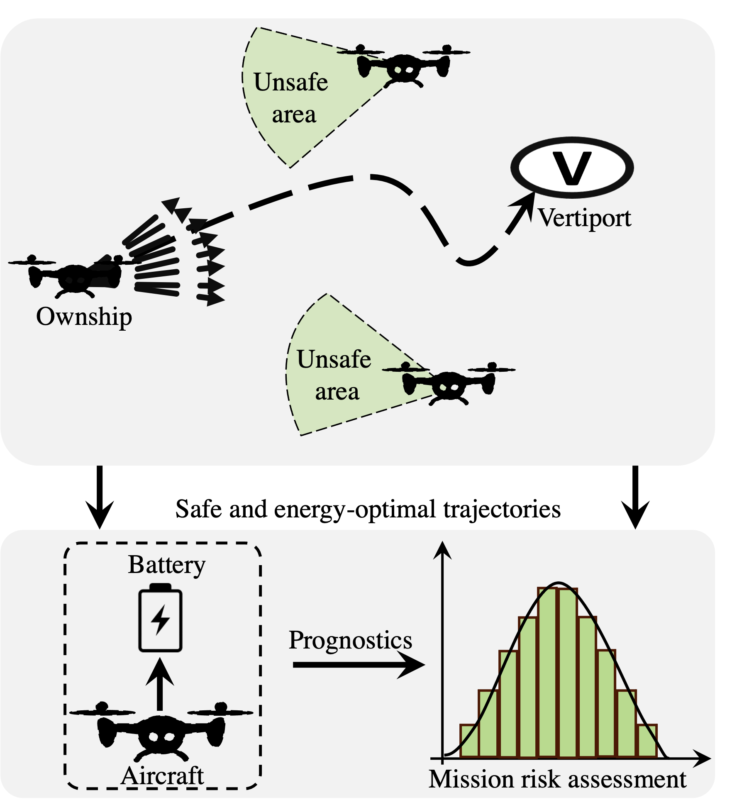

Pre‑departure Flight Planning and Risk Assessment for UAM/UAS Operations under Battery Constraint
===================================

Overview
--------

This repository contains the implementation of a decision-making framework for Urban Air Mobility (UAM) and Unmanned Aerial Systems (UAS) operations, focusing on enhancing collision safety and battery energy use. The framework features a novel two-layer algorithm: the upper layer performs strategic de-confliction, and the lower layer handles prognostics and decision-making for mission execution.

    

    
    
Package Delivery Scenario   
--------
The scenario we used to implement the framework and test its performance is designed for a package delivery application and is implemented for the University Park area of the Dallas-Fort Worth metropolitan region. It includes three depots from which aircraft are expected to take off, and random destination places can be assigned within the $7 km^2$ rectangular area.

.. image:: images/PackageDeliveryScenario.jpg
   :alt: alternate text
   :align: center

Package Delivery Scenario   
--------

Check out the :doc:`usage` section for further information, including
how to :ref:`installation` the project.

.. note::

   This project is under active development.

Contents
--------

.. toctree::

   usage
   api
