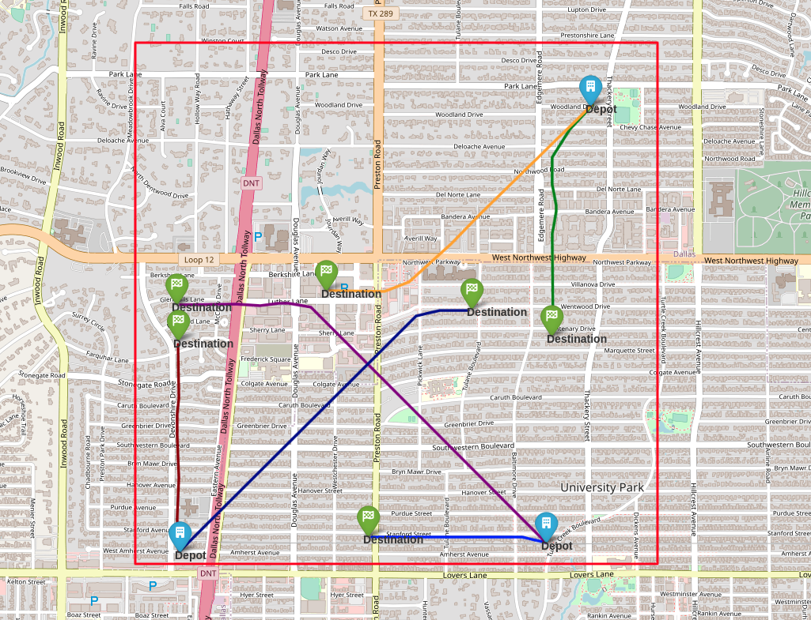

Package Delivery Scenario   
=========
The scenario we used to implement the framework and test its performance is designed for a package delivery application and is implemented for the University Park area of the Dallas-Fort Worth metropolitan region. It includes three depots from which aircraft are expected to take off, and random destination places can be assigned within the :math:`7 \, \text{km}^2` rectangular area.

In the above figure, the red rectangle depicts the rectangular area considered within the DFW region for the package delivery scenario. Additionally, the strategically de-conflicted trajectories for each aircraft, from their assigned depots to their destinations, are plotted in various colors. These trajectories are generated using the upper layer of the framework. 

