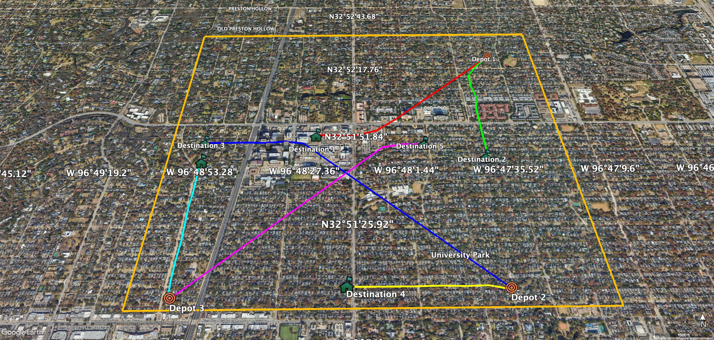

Package Delivery Scenario   
=========
The scenario we used to implement the framework and test its performance is designed for a package delivery application and is implemented for the University Park area of the Dallas-Fort Worth metropolitan region. It includes three depots from which aircraft are expected to take off, and random destination places can be assigned within the $7 km^2$ rectangular area.

