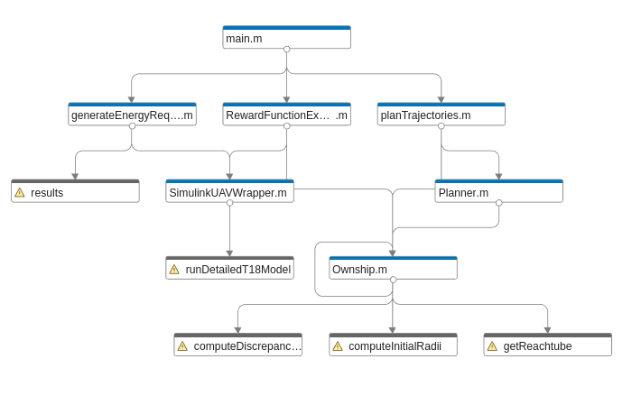

Usage
=====

.. _installation:

Installation
------------

1. Clone the repository to your local machine using the follwing command:

.. code-block::

    git clone https://github.com/Abenezergirma/Chapter-2.git

2. Ensure you have the required softwares installed with their dependancies (MATLAB, Python, Simulink, etc.).
3. Set up the project environment following the guidelines in the project documentation.

The project is developed using MATLAB, Simulink, and Python codes. The following image shows the architecture of the MATLAB code that implements the trajectory planner (upper layer) part of the framework. 

   

Project Structure
-----------------

The project is organized into several key components:

Trajectory Planner
------------------

- **Ownship.m**: A MATLAB class responsible for guidance modeling.
- **Planner.m**: A MATLAB class handling trajectory planning algorithms.
- **Trajectory Planning Results**: Contains saved data and figures.
- **planTrajectories.m**: MATLAB script to execute trajectory planning and save results.
- **VisualizeTrajectory.m**: A class for plotting trajectory planning data.

Energy Requirement
------------------

- **UAV Simulink model**: Contains the Simulink model of the UAV.
- **SimulinkUAVWrapper.m**: A MATLAB class acting as a wrapper for the Simulink model.
- **Energy Requirement Results**: Holds saved power-related parameters.
- **generateEnergyRequirement.m**: MATLAB script to simulate the UAV model and generate energy requirement data.

Battery Prognostics
-------------------

- **BatteryPrognosticsLibrary.py**: A Python class containing a prognostics library.
- **Battery_electrochemistry_model.py**: Python script with the battery model.
- **Battery Prognostics Results**: Stores battery prognostics-related results.
- **Visualize_prognostics.py**: Python class with methods for visualizing battery prognostics results.

Reward Function Experiment
--------------------------

- **RewardFunctionExperiments.m**: A MATLAB class that constructs experiments for reward function generation, inheriting from Ownship and SimulinkUAVWrapper classes.
- **Reward Function Experiment Results**: Contains files and figures from reward function experiments.
- **rewardExperiment.m**: MATLAB script to run reward function experiments and save results.

Decision Maker
--------------

- **decision maker.py**: The main script that runs the entire system and makes decisions based on the risk assessment.

   

Implementation Guideline
-----------------

Follow these steps to successfully implement the project:

1. **Trajectory Planning and Energy Analysis**:
   Start the project by executing :code:`main.m`. This script is responsible for performing trajectory planning and analyzing the energy requirements of each aircraft.

2. **Energy Requirement Simulation**:
   Use :code:`generateEnergyRequirement.m` to simulate the aircraft's operation and determine its energy requirements. This step is crucial for understanding the power consumption patterns under various conditions.

3. **Battery Prognostics Analysis**:
   Dive into battery state of charge (SoC) predictions by utilizing the Python library found in the :code:`Battery Prognostics` folder. This analysis helps in assessing the longevity and efficiency of the UAV's battery.

4. **Development of Reward Functions**:
   Go to :code:`RewardFunctionExperiments` to develop and experiment with various reward functions. These functions are essential for evaluating different operational strategies based on their outcomes.

5. **Decision Making Based on Risk Assessment**:
   Finally, execute :code: `decision_maker.py`to apply the decision-making regarding whether to execute the flight or not. This script integrates the risk assessment and makes informed decisions to optimize UAV operations.

For more detailed information on each step, refer to the corresponding sections in the documentation.

